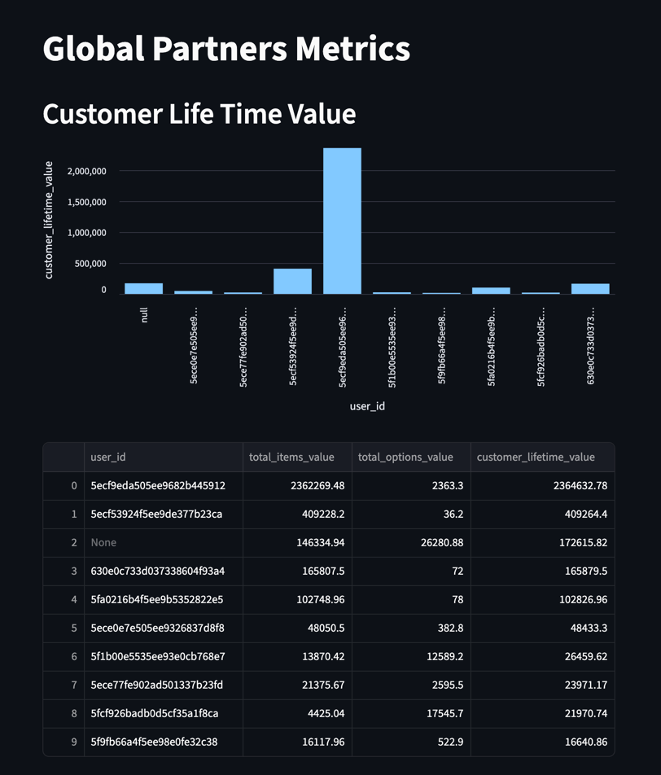
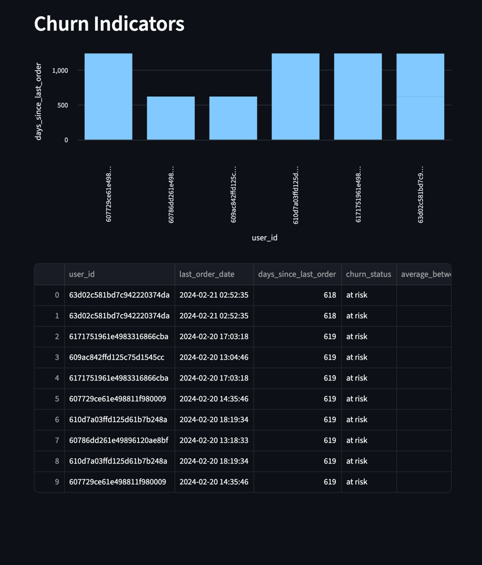

### 1. Introduction and Business Goals

- **Problem Statement:** 
	Create these following Metrics the first one being the primary and most important.
	- Customer Lifetime Value (CLV)
	- Customer Segmentation & Behavior
	- Churn Indicators
	- Sales Trends Monitoring
	- Loyalty Program Impact
	- Top-Performing Locations
	- Pricing & Discount Effectiveness
    
- **Scope:** 
	- The content within the google documents
		- order_items.csv
		- order_item_options.csv
		- date_dim.csv
    
- **Business Objectives:** Create 7 marts and 7 dashboards representing the content of those marts.
	- Pipeline architecture diagram and explanation.
	- Create a solution design document.
	- Written approval from the SME.
	- Use tools like draw.io, miro, etc for diagrams.
    

---

### 2. Requirements

This section details the specific requirements the solution must meet.

**Functional Requirements:**
- AWS only
- PYSpark for all ETL logic
- Reoccurring Schedule
- Encryption
- Failure Reload Mechanism
- Streamlit Dashboards

---

###  3. Architectural Design

This is the high-level overview of the system.
#### High-Level Diagram:


## Technology Stack 

---

### Data Source 
Amazon RDS derived from S3 Bucket CSVs

---

### **Raw Data Ingestion (Extraction)**
S3 → RDS

You will need to create a VPC endpoint for `com.amazonaws.us-east-1.s3`
Make sure to add the RDS route table to the VPC endpoint.

```SQL
CREATE DATABASE global_partners;
CREATE EXTENSION aws_s3 CASCADE;
```

```SQL
CREATE TABLE date_dim (
    date_key TEXT,
    year SMALLINT,
    month SMALLINT,
    week SMALLINT,
    day_of_week TEXT,
    is_weekend BOOLEAN,
    is_holiday BOOLEAN,
    holiday_name TEXT
);

SET DateStyle = 'ISO, DMY';
SELECT aws_s3.table_import_from_s3(
   'date_dim',                               -- 1. Table name
   '',                                       -- 2. Columns (empty string for all)
   '(FORMAT csv, HEADER true)',              -- 3. Options (HEADER true replaces IGNORE 1 ROWS)
   'global-partners-business-dea-project',   -- 4. S3 Bucket
   'date_dim.csv',                           -- 5. S3 File Path (Key)
   'us-east-1'                               -- 6. S3 Region (e.g., 'us-east-1', 'us-west-2')
);

CREATE TABLE order_items_fct (
    ORDER_ITEM_PK BIGINT PRIMARY KEY GENERATED ALWAYS AS IDENTITY,
    APP_NAME VARCHAR(255),
    RESTAURANT_ID VARCHAR(24),
    CREATION_TIME_UTC TIMESTAMPTZ,
    ORDER_ID VARCHAR(24),
    USER_ID VARCHAR(24),
    PRINTED_CARD_NUMBER VARCHAR(255), -- Allowed to be NULL
    IS_LOYALTY BOOLEAN,
    CURRENCY VARCHAR(3),
    LINEITEM_ID VARCHAR(24),
    ITEM_CATEGORY VARCHAR(255),
    ITEM_NAME VARCHAR(255),
    ITEM_PRICE NUMERIC(10, 2),
    ITEM_QUANTITY INTEGER,
  
  
);


SELECT aws_s3.table_import_from_s3(
   'order_items_fct',                               -- 1. Table name
   'APP_NAME, RESTAURANT_ID, CREATION_TIME_UTC, ORDER_ID, USER_ID, PRINTED_CARD_NUMBER, IS_LOYALTY, CURRENCY, LINEITEM_ID, ITEM_CATEGORY, ITEM_NAME, ITEM_PRICE, ITEM_QUANTITY',                                       -- 2. Columns (empty string for all)
   '(FORMAT csv, HEADER true)',              -- 3. Options (HEADER true replaces IGNORE 1 ROWS)
   'global-partners-business-dea-project',   -- 4. S3 Bucket
   'order_items.csv',                           -- 5. S3 File Path (Key)
   'us-east-1'                               -- 6. S3 Region (e.g., 'us-east-1', 'us-west-2')
);

CREATE TABLE order_item_options_fct (
    ORDER_OPTION_PK BIGINT PRIMARY KEY GENERATED ALWAYS AS IDENTITY,
    ORDER_ID VARCHAR(24),
    LINEITEM_ID VARCHAR(24),
    OPTION_GROUP_NAME VARCHAR(255),
    OPTION_NAME VARCHAR(255),
    OPTION_PRICE NUMERIC(10, 2),
    OPTION_QUANTITY INTEGER
    
);

DROP TALBE order_options_fct;

SELECT aws_s3.table_import_from_s3(
   'order_item_options_fct',                               -- 1. Table name
   'ORDER_ID, LINEITEM_ID, OPTION_GROUP_NAME, OPTION_NAME, OPTION_PRICE, OPTION_QUANTITY',                                       -- 2. Columns (empty string for all)
   '(FORMAT csv, HEADER true)',              -- 3. Options (HEADER true replaces IGNORE 1 ROWS)
   'global-partners-business-dea-project',   -- 4. S3 Bucket
   'order_item_options.csv',                           -- 5. S3 File Path (Key)
   'us-east-1'                               -- 6. S3 Region (e.g., 'us-east-1', 'us-west-2')
);
```


```SQL
CREATE USER glue_user WITH PASSWORD 'wfn@TCV9pxb0wgc7zcd';

GRANT CONNECT ON DATABASE global_partners TO glue_user;

GRANT USAGE ON SCHEMA public TO glue_user;

GRANT SELECT ON ALL TABLES IN SCHEMA public TO glue_user;

-- 1. Allows 'glue_user' to access the 'public' folder
GRANT USAGE ON SCHEMA public TO glue_user;

-- 2. Allows 'glue_user' to read the 'date_dim' file
GRANT SELECT ON TABLE public.date_dim TO glue_user;

ALTER DEFAULT PRIVILEGES IN SCHEMA public GRANT SELECT ON TABLES TO glue_user;
GRANT rds_superuser TO glue_user;
```

---

### Bronze Stage
**RDS → S3 Bucket (Bronze Stage)**
Data is ingested by the AWS lambda function from Google Drive.

---

### Silver Stage
**Bronze Stage ← Glue Job → RedShift (Silver Stage)**
Glue is chosen because of the requirement for using only Amazon Services. This Glue Job will be used to Clean and Transform the data, then store it in Redshift
```SQL
CREATE TABLE IF NOT EXISTS public.date_dim (
    date_key VARCHAR(10),
    year SMALLINT,
    month SMALLINT,
    week SMALLINT,
    day_of_week VARCHAR(10),
    is_weekend BOOLEAN,
    is_holiday BOOLEAN,
    holiday_name VARCHAR(255)
);

CREATE TABLE IF NOT EXISTS public.order_item_options (
    ORDER_ID VARCHAR(255),
    LINEITEM_ID VARCHAR(255),
    OPTION_GROUP_NAME VARCHAR(100),
    OPTION_NAME VARCHAR(100),
    OPTION_PRICE DECIMAL(8, 2),
    OPTION_QUANTITY SMALLINT      
);

CREATE TABLE IF NOT EXISTS public.order_items (
    APP_NAME VARCHAR(50),
    RESTAURANT_ID VARCHAR(255),
    CREATION_TIME_UTC TIMESTAMP,      
    ORDER_ID VARCHAR(255),
    USER_ID VARCHAR(255),
    PRINTED_CARD_NUMBER VARCHAR(20),  
    IS_LOYALTY BOOLEAN,
    CURRENCY CHAR(3),                  
    LINEITEM_ID VARCHAR(255),
    ITEM_CATEGORY VARCHAR(50),
    ITEM_NAME VARCHAR(255),
    ITEM_PRICE DECIMAL(8, 2),        
    ITEM_QUANTITY SMALLINT          
);
```

---

### Gold Stage
**Silver Stage ← Glue Job → Redshift (Gold Stage)**
Glue is chosen because of the requirement for using only Amazon Services. A Glue Job will aggregate the data utilizing pyspark and store it in Redshift. This will have 7 different marts.

- Customer Lifetime Value (CLV)
```SQL
CREATE OR REPLACE VIEW CLV AS 
WITH sum_order_options as (
    SELECT 
        order_id,
        SUM(option_price * option_quantity) AS sum_options
    FROM public.order_item_options
    GROUP BY order_id
)
SELECT 

    user_id,
    SUM(item_price * item_quantity) as total_items_value,
    SUM(soo.sum_options) AS total_options_value, 
    SUM(item_price * item_quantity) + SUM(soo.sum_options) AS customer_lifetime_value

FROM public.order_items as oi
JOIN sum_order_options AS soo 
    ON soo.order_id = oi.order_id
GROUP BY oi.user_id
ORDER BY customer_lifetime_value DESC
LIMIT 10;
```
- Customer Segmentation & Behavior
- Churn Indicators
```SQL
CREATE OR REPLACE VIEW CHURN_INDICATORS AS 
WITH order_gap AS
(
    SELECT 
        user_id,
        CREATION_TIME_UTC as order_date,
        LAG(oi.CREATION_TIME_UTC) OVER (
            PARTITION BY user_id
            ORDER BY order_date
        ) as previous_order_date
    FROM public.order_items AS oi
),
sum_order_options as (
    SELECT 
        order_id,
        SUM(option_price * option_quantity) AS sum_options
    FROM public.order_item_options
    GROUP BY order_id
),
sum_orders as (
    SELECT
        EXTRACT(year FROM so.CREATION_TIME_UTC) AS order_year,
        user_id,
        SUM(item_price * item_quantity) + SUM(soo.sum_options) AS total_value

    FROM public.order_items AS so
    JOIN sum_order_options as soo
        ON soo.order_id = so.order_id
    GROUP BY user_id, order_year

),
yoy_change AS (
    SELECT
        so.user_id,
        so.order_year,
        so.total_value AS current_year_total_value,
        LAG(so.total_value, 1) OVER (
            PARTITION BY user_id
            ORDER BY order_year
        ) AS previous_year_total_value
    FROM sum_orders AS so
)
SELECT 
    oi.user_id,
    MAX(oi.CREATION_TIME_UTC) as last_order_date,
    DATEDIFF(day, MAX(oi.CREATION_TIME_UTC), CURRENT_DATE) AS days_since_last_order,
    CASE
        WHEN DATEDIFF(day, MAX(oi.CREATION_TIME_UTC), CURRENT_DATE) > 45 THEN 'at risk'
        WHEN DATEDIFF(day, MAX(oi.CREATION_TIME_UTC), CURRENT_DATE) > 45 THEN ''
        END AS churn_status,
    COALESCE(AVG(DATEDIFF(day, og.previous_order_date, og.order_date)), 0) AS average_between_orders,
    (yc.current_year_total_value - yc.previous_year_total_value) 
        / NULLIF(yc.previous_year_total_value, 0) * 100.0 AS yoy_percentage_change
FROM public.order_items AS oi
JOIN order_gap AS og
    ON og.user_id = oi.user_id
JOIN yoy_change AS yc 
    ON yc.user_id = og.user_id
GROUP BY oi.user_id, yc.current_year_total_value, yc.previous_year_total_value
ORDER BY days_since_last_order
LIMIT 10;
```
- Sales Trends Monitoring
- Loyalty Program Impact
- Top-Performing Locations
- Pricing & Discount Effectiveness

---

### Dashboards (Streamlit)
Then we can hit RedShift directly with Streamlit on the views to create BI dashboards.


### 4. Data Model


# Deliverable
- Pipeline architecture diagram and explanation.
    
- Create a solution design document.
    
- Written approval from the SME.
    
- Use tools like draw.io, miro, etc for diagrams.




